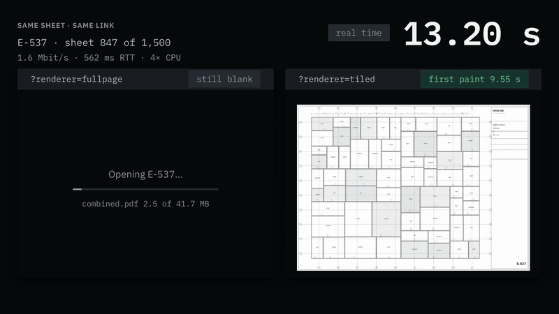

<h1 align="center">Gridline</h1>

<p align="center">A drawing-set workspace for construction teams in the field.</p>

<p align="center">
  
</p>

A construction project issues 1,500–2,000 large-format drawing sheets. On site, a superintendent needs to open the current revision of a sheet, see what changed since they last looked, and mark it up. They usually work on a tablet, often with a poor connection.

Gridline is a frontend built for that job. It renders very large drawing sets in the browser, and it is split into microfrontends that deploy independently.

## Architecture

Four microfrontends, composed at runtime with Rspack Module Federation 2.0:

- **Shell** — routing, layout, loading the other apps, offline banner
- **Viewer** — renders one sheet from tiles, with pan, zoom and a markup overlay
- **Navigator** — a scrollable thumbnail grid of the whole set, with discipline filters
- **Compare** — the difference between two revisions, with an onion-skin blend and synced zoom

The apps never import each other. They communicate only through an event bus in the shared platform package, and every message is validated with zod. There is no shared mutable state.

## Independent deployment

The shell contains no remote addresses. At startup it reads them from `remotes.json`, a static file on its own origin, and registers the remotes after its first render. Two properties follow, and both can be checked by hand.

### Rebuilding a remote leaves the shell unchanged

```bash
pnpm build
find apps/shell/dist -type f | sort | xargs shasum -a 256 | shasum -a 256

# change something in apps/viewer, then rebuild that app alone
turbo run build --filter=@gridline/viewer

find apps/shell/dist -type f | sort | xargs shasum -a 256 | shasum -a 256
```

Results from 2026-09-29, over three consecutive viewer builds:

```
shell/dist   before  fdf22dc7ba3d372fcafd30839ab93a7b15feaebb991dc407d2e26160b5c2751c
shell/dist   after   fdf22dc7ba3d372fcafd30839ab93a7b15feaebb991dc407d2e26160b5c2751c

viewer/dist  before  f7b4dfecebf3de711e9298f126a9b94b53181e96db41bde692ce4a093ee2eeff
viewer/dist  after   8ef18bb5f50962477ba055e440dcf72f208b5d4cac35ee12bf7126ff3be2c833
```

The shell's files are identical before and after. Reloading the shell loaded the new viewer, and events from the viewer still arrived on the bus.

### Moving a remote needs no build

Serve a second viewer build on another port, edit the deployed `remotes.json`, and reload. No bundler runs, and the shell's JavaScript stays byte-identical:

```
shell/dist, excluding remotes.json   41ee0066d3ee51d61122a2150ac3913d4f6ef0b57e73c11967e6721086b03b41
```

Only `remotes.json` changes. Remote addresses are deployment data, not compiled code, so a remote can move without the shell being rebuilt or redeployed.

Both checks run against `pnpm serve`, a dependency-free static file server over each app's `dist/`. They are not run against a dev server, because a dev server adds headers and behaviour that a static host does not.

## Stack

| Concern     | Choice                                                                |
| ----------- | --------------------------------------------------------------------- |
| Framework   | React 19 + TypeScript (strict)                                        |
| Federation  | Rspack Module Federation 2.0                                          |
| Rendering   | Canvas 2D + OffscreenCanvas                                           |
| PDF parse   | pdf.js in a dedicated worker                                          |
| State       | Zustand (per-MFE) + shared platform store                             |
| Styling     | Tailwind + CSS custom properties from platform                        |
| Persistence | The browser's own HTTP cache for tiles; IndexedDB planned for markups |
| Network     | Mock Service Worker (MSW) — no backend                                |
| Input       | Hand-rolled gesture layer over Pointer Events                         |
| Testing     | Vitest (unit) + Playwright (e2e + perf traces)                        |

## No backend

Gridline has no API server, database or BFF. All network traffic is handled in the browser by Mock Service Worker (MSW). Network conditions can therefore be scripted — 3G latency, tile failures, a disconnect mid-session — and measurements reproduce more reliably than they would against a real server.

## Project structure

```
gridline/
├─ packages/platform/    # @gridline/platform — tokens, UI primitives, event bus, stores
├─ apps/
│  ├─ shell/             # Host app
│  ├─ viewer/            # Sheet rendering remote
│  ├─ navigator/         # Set browsing remote (in progress)
│  └─ compare/           # Revision diff remote (planned)
├─ tools/
│  ├─ serve.mjs          # Static file server for the production builds
│  ├─ setgen/            # Synthetic drawing-set generator
│  └─ tiler/             # PDF → tile pyramid pipeline
└─ docs/adr/             # Architecture decision records (planned)
```

Entries marked planned do not exist yet.

## Test data

The drawing set is generated from a fixed seed, so every run measures the same document.

```bash
pnpm setgen
# 1500 sheets, 42.2 MB, ~20s
# set checksum b95b5f468d12b08a5bbb9d78ac394c8ad54ee6cdd36fc8bff0a66fcfe76739be
```

`tools/setgen` writes 1,500 ARCH E1 sheets (30 × 42 in) as vector PDFs. Each sheet has column grids, subdivided floor plates, hatching, room tags, dimension strings and a ruled title block, which makes rasterizing it non-trivial. Sheet numbers use standard discipline prefixes: `A-101`, `AD-201`, `S-304`, `M-412`, `E-508`.

- Each sheet is seeded by its own sheet number. Regenerating one sheet produces the same bytes as the full run.
- Every timestamp in the PDF output is fixed, so a checksum depends only on content.
- The output is not committed. To compare two sets, compare the set checksum: one hash over all 1,500 per-sheet hashes, in sheet-number order.

## Performance

All figures come from committed Playwright specs, run on one machine. Full results, including what they do not show, are in [`docs/perf/viewer.md`](docs/perf/viewer.md).

Test conditions:

- **Document:** one PDF of 1,500 pages, 41.7 MB. Sets reach the field as a single file: jurisdictions accept submittals up to 500 MB and only allow splitting by discipline above 100 MB.
- **CPU:** 4x throttle.
- **Network:** 1.6 Mbit/s with a 562 ms round trip. The static server applies this, not the browser, because CDP sets network conditions per target and a service worker is a separate target.
- **Renderers:** both ship. Choose one with `?renderer=fullpage` or `?renderer=tiled`.

| Measurement                          | `fullpage`   | `tiled`                                |
| ------------------------------------ | ------------ | -------------------------------------- |
| First sheet on screen, cold          | 225.5 s      | **9.55 s**                             |
| Main-thread block during load        | 1120 ms      | **134 ms**                             |
| Longest single task                  | 875 ms       | **81 ms**                              |
| Peak memory over a 50-sheet session  | 2230 MB      | **182 MB**                             |
| Sheet change, jumping across the set | **210 ms**   | 1821 ms                                |
| Sheet change, reading in order       | **210 ms**   | **35 ms** on a third to a half of them |
| Return to a visited sheet            | not measured | **84 ms**                              |

The `tiled` column was re-taken with the navigator and the shell's rail on the page, and with every response from a server sharing one throttled link, as a real connection does. The `fullpage` column is from earlier runs; its figures are dominated by the 42 MB transfer, which neither change touches.

### `fullpage`

Parses the whole PDF on the main thread before drawing anything, so time to first sheet grows with document size. Of its 225.5 s, 217.7 s is downloading the document; rendering the requested page takes 278 ms. It keeps every page it renders, so memory grows 43.6 MB per sheet and reaches 2.18 GB after fifty.

### `tiled`

Fetches only the tiles that cover the viewport, from a pyramid built ahead of time by `tools/tiler`. Time to first sheet grows with screen size, not document size.

Decoded tiles are held in a memory cache with two tiers:

- **Detail tiles** — up to 256 MB, least-recently-used evicted first. Evicted bitmaps are closed explicitly, because canvas pixels live outside the JS heap and do not appear in `JSHeapUsedSize` or `performance.memory`.
- **Coarse tiles** — the low-resolution levels that let a revisited sheet repaint immediately. They have their own 170 MB ceiling and are evicted one whole sheet at a time, because a sheet missing one coarse tile paints with a hole in it. The ceiling is set in bytes, not sheets, because cost depends on sheet shape: five tiles for a standard landscape sheet, eight for portrait.

Memory stays flat. Over 140 sheets it rises about 5 MB per sheet, then holds at the coarse-tile ceiling for the rest of the session, with every sheet painted. Peak over fifty sheets is 182 MB. Memory depends on the budget, not on how many sheets are opened.

### Sheet change: jumping vs. reading in order

The two sheet-change rows measure the same code under two reading patterns.

- **Jumping (1821 ms)** visits every thirtieth sheet. Nothing nearby is ever reused, so no result depends on luck.
- **Reading in order (35 ms on a third to a half)** visits the same 50 sheets in sequence. While the network is idle, the viewer fetches the coarse tiles of neighbouring sheets. Between 17 and 25 of the 49 sheet changes, across runs, are then served from memory; the rest are no faster. The results fall into two groups, so the table reports the split instead of a median. With `?prefetch=0`, 0 of 49 changes are fast.

`fullpage` is faster between sheets because it paid for all of them up front. Prefetching does not help a reader who jumps around the set, so 1821 ms remains the real cost of a jump.

### Revisits

The 84 ms revisit figure is a median over two groups. Sheets that still hold their coarse tiles repaint from memory. Sheets evicted past the ceiling refetch their tiles from the browser cache and decode them. Both are fast because tiles are served `immutable`; opening a new sheet over the same link takes 1821 ms.

Revisit time depends on which group the three sampled sheets fall in. Prefetched sheets share the coarse tier with visited ones, so visited sheets are evicted sooner: it read 98 ms before prefetch, 112 ms after, and 84 ms in the latest runs.

## Status

Pre-alpha.

**Built**

- Platform package: design tokens, the event bus, and eleven UI primitives.
- Shell: renders its chrome from the tokens and loads the viewer and the navigator at runtime. Active-sheet state crosses the bus between them.
- Navigator: all 1,500 sheets in a virtualised grid with thumbnails and discipline filters (`?view=sheets`), and as a list beside the drawing. A click opens a sheet; the grid also moves by arrow key and opens on Enter, and beside a drawing Shift+Up and Shift+Down step through the set.
- All three apps run from their production builds on separate origins.
- The synthetic drawing set generator.
- `tools/tiler`, which builds the tile pyramid offline.
- Viewer: picks a tile level from the viewport, keeps memory within two budgets, and prefetches neighbouring sheets while the network is idle. Includes a canvas toolbar, a properties panel, and a cache readout behind `?perf=1`.
- A hand-rolled gesture layer for pinch, pan, momentum and wheel zoom, costing 0 ms of main-thread time.

**Dropped**

- An IndexedDB tile store. Tiles are served `immutable`, so the browser already keeps them on disk: a reloaded sheet opens in 93–100 ms, against 1352–1357 ms with that cache disabled. A second disk cache would add nothing. IndexedDB returns later for offline support.

**Not built yet**

- Deep zoom past the pre-rendered levels, blocked because a worker script must share the page's origin
- The compare remote
- Markup
- Per-app deployment pipelines

## License

MIT
